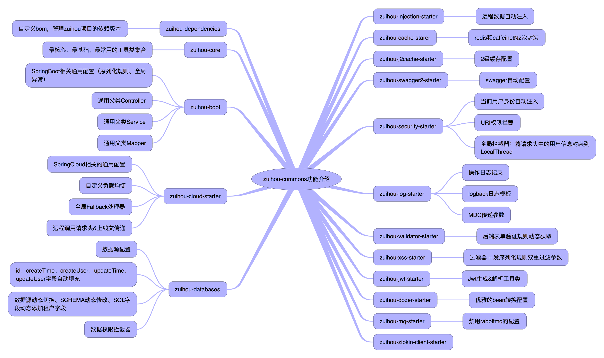

# cp3-cloud-commons

## 简介
`cp3-cloud-commons` 是 [cp3-cloud](https://gitee.com/huhua1990/cp3-cloud) 项目的核心工具包，开发宗旨是打造一套兼顾 SpringBoot 和 SpringCloud 项目的公共工具类。

## 结构介绍

## 主要功能
- Mvc封装： 通用的 Controller、Service、Mapper、全局异常、全局序列化、反序列化规则
- SpringCloud封装：请求头传递、调用日志、灰度、统一配置编码解码规则等
- 关联数据注入：优雅解决 跨库表关联字段回显、跨服务字段回显 (开发中)
- 持久层增强：增强MybatisPlus Wrapper操作类、数据权限
- 枚举、字典等字段统一传参、回显格式： 解决前端即要使用编码，有要回显中文名的场景。
- 在线文档：对swagger、knife4j二次封装，实现配置即文档。 (开发中)
- 前后端表单统一校验：还在为前端写一次校验规则，后端写一次校验规则而痛苦不堪？ 本组件将后端配置的jsr校验规则返回给前端，前端通过全局js，实现统一的校验规则。 (开发中)
- 缓存：封装redis缓存、二级缓存等，实现动态启用/禁用redis  (开发中)
- XSS： 对表单参数、json参数进行xss处理  (开发中)
- 统一的操作日志： AOP方式记录操作日志
- 接口权限
- 快去看源码和文档，发现更多功能吧

## 项目代码地址
* cp3-cloud-commons | https://github.com/huhua1990/cp3-cloud/cp3-cloud-commons | 核心工具类：boot和cloud 项目的公共抽象 |
* cp3-cloud | https://github.com/huhua1990/cp3-cloud | 微服务项目 |

如果觉得对您有任何一点帮助，请点右上角 "Star" 支持一下吧，谢谢！

## 友情链接 & 特别鸣谢
* MyBatis-Plus：[https://mybatis.plus/](https://mybatis.plus/)
* knife4j：[http://doc.xiaominfo.com/](http://doc.xiaominfo.com/)
* hutool：[https://hutool.cn/](https://hutool.cn/)
* xxl-job：[http://www.xuxueli.com/xxl-job/](http://www.xuxueli.com/xxl-job/)
* kkfileview：[https://kkfileview.keking.cn](https://kkfileview.keking.cn)
* j2cache：[https://gitee.com/ld/J2Cache](https://gitee.com/ld/J2Cache)

